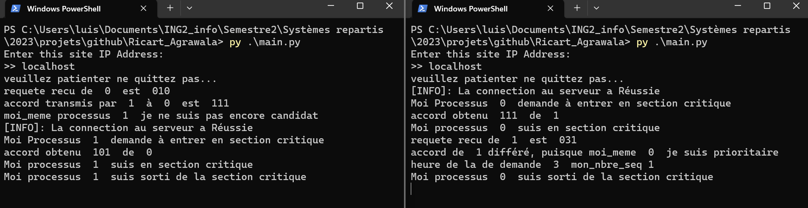

# Ricart_Agrawala
Algorithme of Distributed system with python

### How we can run
###### run it in a network, you can use many IP addresses to see the distributed system
    python main.py

### Licence
Open source

### Teacher :
    Dr. LOKPO IBRAHIM

### Students
    - BINI Aladji Kassoum
    - KONAN Kouadio Aimé Junior Stéphane
    - MEDA Kechiedou Luis-Borges Dégrize
    
    student engineer cumputerscientist 2nd year 
